# 💫 About Me:
Hi there! I'm **Bhavya Popat**, better known as *BhavyaJustChill*! 

<picture>
  <source media="(max-width: 760px) and (prefers-color-scheme: dark)" srcset="./dark-mobile.svg">
  <source media="(max-width: 760px)" srcset="./light-mobile.svg">
  <source media="(prefers-color-scheme: dark)" srcset="./dark.svg">
  <source media="(prefers-color-scheme: light)" srcset="./light.svg">
  
</picture>

 📚 Always learning, always improving. 📈 Code. Debug. Deploy. Repeat. 🚀 Building dreams one line of code at a time. 🖥️ Full-stack wizard: MERN by day, Flutter by night. 🤖 AI Enthusiast: Building next-gen, AI-enabled full-stack applications. ⚡ Merging machine intelligence with clean, scalable architectures. 🌐 3D Web Creator: Crafting interactive, immersive 3D web experiences with Three.js & R3F. 💻 Turning caffeine into clean, scalable code. 🌍 On a mission to create impactful web and mobile solutions. 🛠️ Tinkering with tech to make life better. 🖤 Open-source enthusiast and lifelong learner. ✨ Transforming ideas into robust applications. 📝 Writing code that speaks louder than words.

## 🌐 Socials:
    

# 💻 Tech Stack:
                                               

# 📊 GitHub Stats:
 
 

# ✍️ Random Dev Quote

